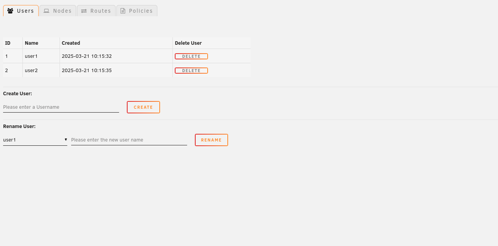
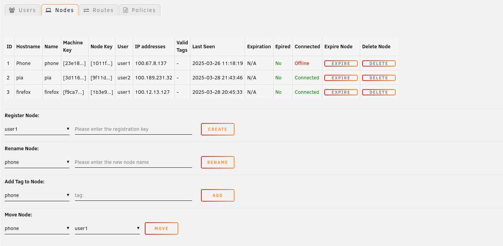
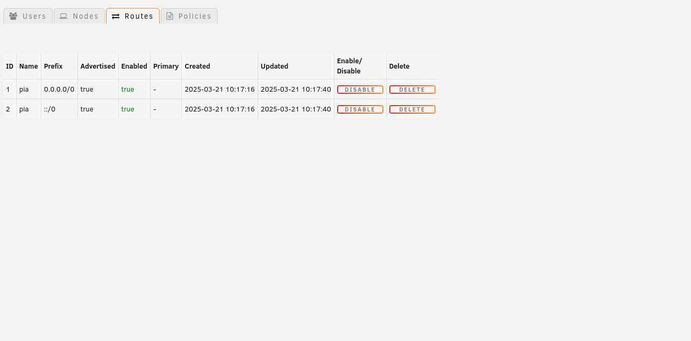
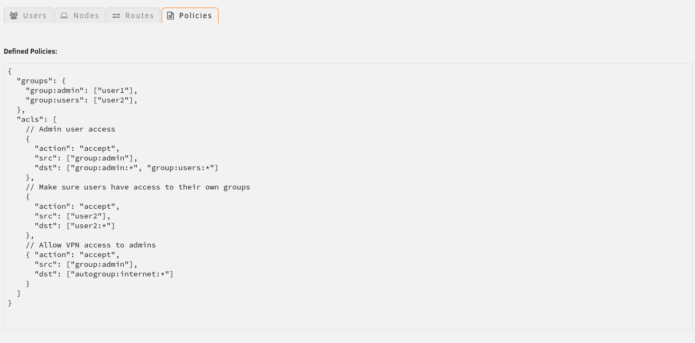
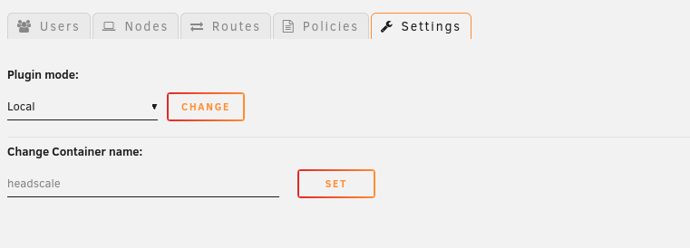

# Headscale Admin Panel Plugin for Unraid

This Plugin gives you the ability to Manage your Headscale Docker Container from within your Unraid WebUI.

#### Note: This plugin supports both Local Mode (through docker exec) and API Mode (through the API), please visit the settings if you are planing to use the plugin in API mode.

## Installation

1. Download the plugin from the CA App  
The plugin will automatically try to determine the Docker container name from your Headscale instance
2. Go to Settings -> Headscale Admin (at User Utilities)

_If the plugin is not able to determine the correct container name go to Settings -> Headscale Admin (at User Utilities) enter the name from your Headscale Docker container (case sensitve!) and click Set_

## Interface

1. Users Tab:  

On this tab you can see a list from all Users, create, rename and delete them.

2. Nodes Tab:

On this tab you can see a list from all Nodes, register, rename, tag, move, expire and delete them.

3. Routes Tab:

On this tab you can see a list from all Routes, enable, disable and delete them.

4. Policies Tab:

On this tab you can see a list from all your policies if there are any.  
_Please note that this is a static page and only meant to show your policies._

5. Settings:  
Local Mode:  
  
API Mode:  

## How this works

- In Local Mode the plugin pulls information and executes commands directly through `docker exec` from and in your Headscale container.  
- In API Mode the plugin pulls information right from the Headscale API, please note that you have to generate a API Key on your Server first to be able to interact with it. To do that issue: `headscale apikeys create` on the instance that you want to connect to and past the URL alongside with the API Key into the Settings section from the plugin.

## Reporting Issues

Please open up a new issue directly [here in the GitHub Issue tracker](https://github.com/ich777/unraid-headscale-admin/issues) if you find a bug or some functionallity might be missing.

## Disclaimer

I'm not responsible for any data loss, please always make sure to have a backup from your data.  
This plugin is provided as is.